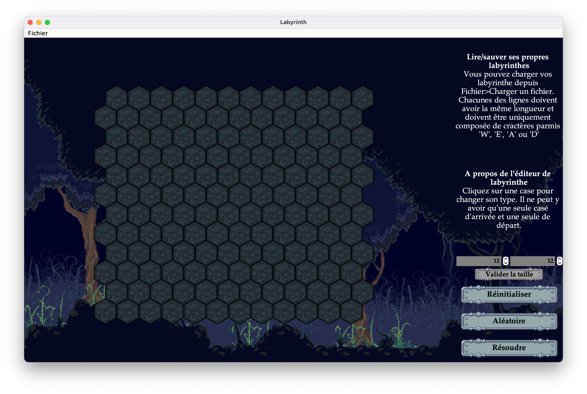

# Solveur de labyrinthes hexagonaux en Java

## Comment l'utiliser ?
1) Télécharger ou cloner le repo (*ex:* ```$ git clone https://github.com/Minifixio/hexagonal-maze-solving-app.git```)
2) Se rendre à ```/out/production/hexagonal-maze-solver``` en faisant ```$ cd hexagonal-maze-solving-app/out/production/hexagonal-maze-solver```
3) Attention : utiliser une version de Java ```>=19.0``` 
4) Faire ```$ java Main```

# Comment cela fonctionne ?
Cliquez sur une tuile pour changer son type. Vous pouvez positionner un point de départ (représenté par le personnage du voyageur) et un point d'arrivée (le drapeau rouge)

Vous pouvez modifier la taille du labyrinthe avec les inputs sur le panneau de droite.

Vous pouvez également générer un albyrinthe aléatoire en cliquant sur le bouton sur le panneau de droite.

Vous pouvez enfin charger et exporter vos fichiers labyrinthes à condition qu'ils respectent le **format de fichier**

# Format de fichier
Pour charger vos labyrinthes vous devez respecter ce format :

1) Vous devez écrire dans un fichier ```txt```
2) Chaque ligne doit être de la même longueur
3) Les lignes se composent de caractères pris dans l'ensemble : ```{'E', 'W', 'A', 'D'}``` avec les correspondances : ```{'E' => Empty Maze Box, 'W' => Wall, 'A' => Arrival, 'A' => Departure}```
4) Vous devez placer **une seule** case de départ (lettre ```D```) et **une seule** case d'arrivée (lettre ```A```)

## Aperçus



