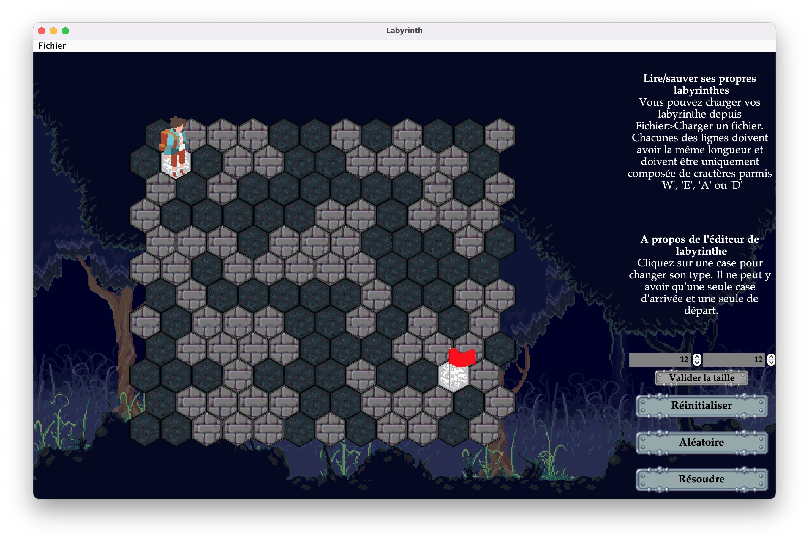
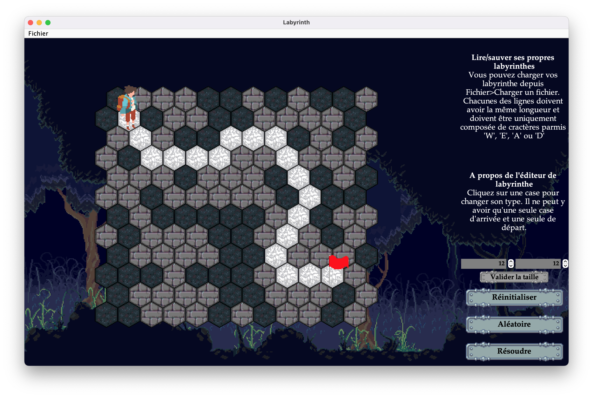
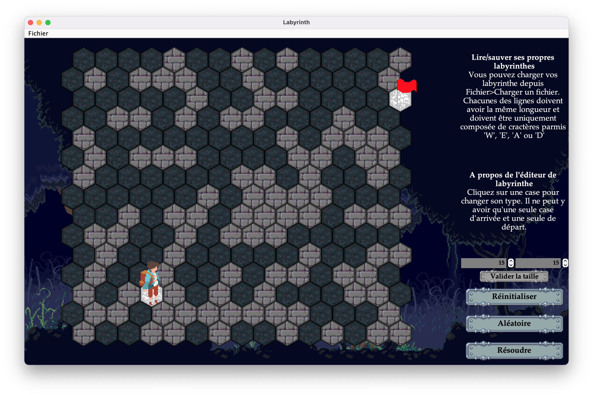

# Java hexagonal maze solving app

## How to use
1) Download or clone this repository (*ex:* ```git clone https://github.com/Minifixio/hexagonal-maze-solving-app.git```)

2) Go to ```/out/production/hexagonal-maze-solver``` using ```cd hexagonal-maze-solving-app/out/production/hexagonal-maze-solver```
3) Use a Java version ```>=19.0``` and run ```java Main```

# How it works
Click on a tile to change its type. You can set the departure point represented by the traveller and the arrival point with the flag.

You can change the labyrinth size with the size inputs.

You can generate a random maze using Randomize button.

You can Load your own Labyrinth files as long as they respect the **file format**

# File format
You can load and export your labyrinths according to a specific format :
1) You must write it in a txt file
2) Each line must be the same length
3) You can only write char among ```{'E', 'W', 'A', 'D'}``` with the corresponding match : ```{'E' => Empty Maze Box, 'W' => Wall, 'A' => Arrival, 'A' => Departure}```
4) You must **only one Departure** case and **only one Arrival**.


## Preview




